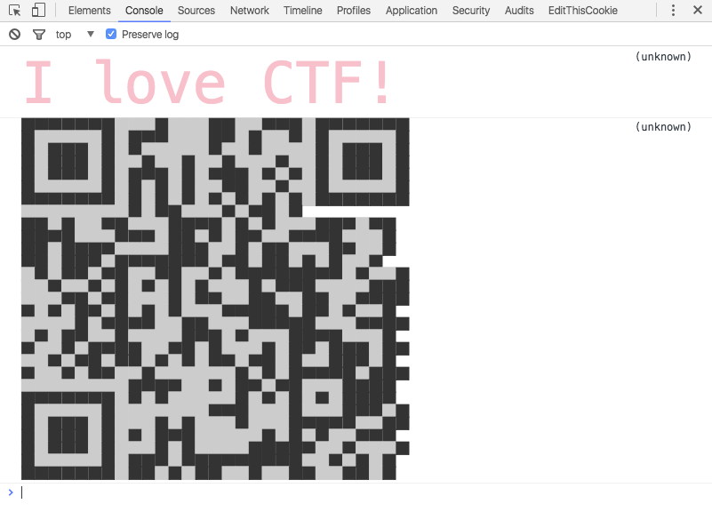

# key #
1. cute.js
	1. http://utf-8.jp/ aaencode
		1. How to decode !? or 能用沙箱得知此javascript實際上做了什麼?
		2. https://cat-in-136.github.io/2010/12/aadecode-decode-encoded-as-aaencode.html
	2. https://github.com/comdan66/browser_console_qrcode
2. 
3. https://zxing.org
